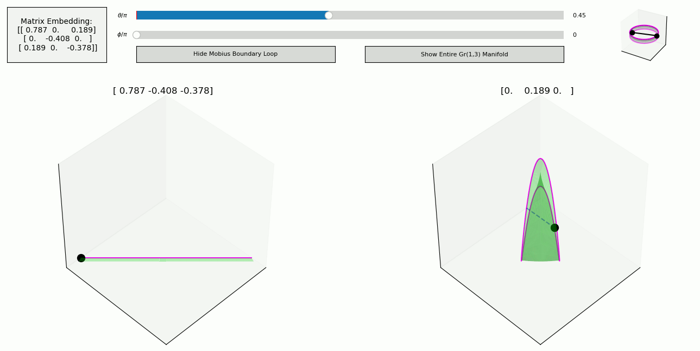

# High Dimensional Visualizations

This repository has a collection of various scripts used to visualize or otherwise improve intuition about high dimensional concepts. Each script begins by printing (to stdout) information about what is being visualized and how to interact with said visualization.

Some screenshots:

